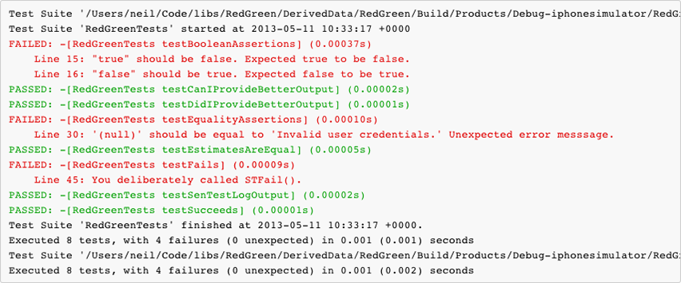

__RedGreen__ is an extension library for __SenTestingKit__ that makes the test output easier to parse by humans. 

## Usage 

### CocoaPods

Add the following to your Podfile:

    pod 'RedGreen', :git => 'https://github.com/neilco/RedGreen.git'

And then, from Terminal, run this:

    pod install

Open the workspace. Build. Test. Bacon. 'Cos you're sizzlin'.

### Standalone

Add __SenTestLog+RedGreen.{h,m}__ to your project's test target. Build. Test. Rejoice. 

## Examples

### Life before RedGreen

Seriously. As quickly as you can, find the tests that __passed__. Quite difficult, huh?

    Test Suite '/Users/neil/Code/libs/RedGreen/DerivedData/RedGreen/Build/Products/Debug-iphonesimulator/RedGreenTests.octest(Tests)' started at 2013-05-11 10:32:02 +0000
    Test Suite 'RedGreenTests' started at 2013-05-11 10:32:02 +0000
    Test Case '-[RedGreenTests testBooleanAssertions]' started.
    /Users/neil/Code/libs/RedGreen/RedGreenTests/RedGreenTests.m:15: error: -[RedGreenTests testBooleanAssertions] : "true" should be false. Expected true to be false.
    /Users/neil/Code/libs/RedGreen/RedGreenTests/RedGreenTests.m:16: error: -[RedGreenTests testBooleanAssertions] : "false" should be true. Expected false to be true.
    Test Case '-[RedGreenTests testBooleanAssertions]' failed (0.000 seconds).
    Test Case '-[RedGreenTests testCanIProvideBetterOutput]' started.
    Test Case '-[RedGreenTests testCanIProvideBetterOutput]' passed (0.000 seconds).
    Test Case '-[RedGreenTests testDidIProvideBetterOutput]' started.
    Test Case '-[RedGreenTests testDidIProvideBetterOutput]' passed (0.000 seconds).
    Test Case '-[RedGreenTests testEqualityAssertions]' started.
    /Users/neil/Code/libs/RedGreen/RedGreenTests/RedGreenTests.m:30: error: -[RedGreenTests testEqualityAssertions] : '(null)' should be equal to 'Invalid user credentials.' Unexpected error messsage.
    Test Case '-[RedGreenTests testEqualityAssertions]' failed (0.000 seconds).
    Test Case '-[RedGreenTests testEstimatesAreEqual]' started.
    Test Case '-[RedGreenTests testEstimatesAreEqual]' passed (0.000 seconds).
    Test Case '-[RedGreenTests testFails]' started.
    /Users/neil/Code/libs/RedGreen/RedGreenTests/RedGreenTests.m:45: error: -[RedGreenTests testFails] : You deliberately called STFail().
    Test Case '-[RedGreenTests testFails]' failed (0.000 seconds).
    Test Case '-[RedGreenTests testSenTestLogOutput]' started.
    Test Case '-[RedGreenTests testSenTestLogOutput]' passed (0.000 seconds).
    Test Case '-[RedGreenTests testSucceeds]' started.
    Test Case '-[RedGreenTests testSucceeds]' passed (0.000 seconds).
    Test Suite 'RedGreenTests' finished at 2013-05-11 10:32:02 +0000.
    Executed 8 tests, with 4 failures (0 unexpected) in 0.001 (0.001) seconds
    Test Suite '/Users/neil/Code/libs/RedGreen/DerivedData/RedGreen/Build/Products/Debug-iphonesimulator/RedGreenTests.octest(Tests)' finished at 2013-05-11 10:32:02 +0000.
    Executed 8 tests, with 4 failures (0 unexpected) in 0.001 (0.002) seconds

### Same output with RedGreen

__RedGreen__ makes that same information much more readable. Again, find the tests that __passed__. Much easier, right?

    Test Suite '/Users/neil/Code/libs/RedGreen/DerivedData/RedGreen/Build/Products/Debug-iphonesimulator/RedGreenTests.octest(Tests)' started at 2013-05-11 10:33:17 +0000
    Test Suite 'RedGreenTests' started at 2013-05-11 10:33:17 +0000
    FAILED: -[RedGreenTests testBooleanAssertions] (0.00037s)
    	Line 15: "true" should be false. Expected true to be false.
    	Line 16: "false" should be true. Expected false to be true.
    PASSED: -[RedGreenTests testCanIProvideBetterOutput] (0.00002s)
    PASSED: -[RedGreenTests testDidIProvideBetterOutput] (0.00001s)
    FAILED: -[RedGreenTests testEqualityAssertions] (0.00010s)
    	Line 30: '(null)' should be equal to 'Invalid user credentials.' Unexpected error messsage.
    PASSED: -[RedGreenTests testEstimatesAreEqual] (0.00005s)
    FAILED: -[RedGreenTests testFails] (0.00009s)
    	Line 45: You deliberately called STFail().
    PASSED: -[RedGreenTests testSenTestLogOutput] (0.00002s)
    PASSED: -[RedGreenTests testSucceeds] (0.00001s)
    Test Suite 'RedGreenTests' finished at 2013-05-11 10:33:17 +0000.
    Executed 8 tests, with 4 failures (0 unexpected) in 0.001 (0.001) seconds
    Test Suite '/Users/neil/Code/libs/RedGreen/DerivedData/RedGreen/Build/Products/Debug-iphonesimulator/RedGreenTests.octest(Tests)' finished at 2013-05-11 10:33:17 +0000.
    Executed 8 tests, with 4 failures (0 unexpected) in 0.001 (0.002) seconds
    
### One more thing...

We can do better and if we can, we should. __RedGreen__ has support for the excellent [XcodeColors](https://github.com/robbiehanson/XcodeColors) plugin, which makes visually parsing the test output a doddle. Now you can find the tests that __passed__ __without having to actually read anything__. A quick glance is all that is needed. 

## License

[MIT license](http://neil.mit-license.org)

Copyright (c) 2013 Neil Cowburn (http://github.com/neilco/)

Permission is hereby granted, free of charge, to any person obtaining a copy
of this software and associated documentation files (the "Software"), to deal
in the Software without restriction, including without limitation the rights
to use, copy, modify, merge, publish, distribute, sublicense, and/or sell
copies of the Software, and to permit persons to whom the Software is
furnished to do so, subject to the following conditions:

The above copyright notice and this permission notice shall be included in
all copies or substantial portions of the Software.

THE SOFTWARE IS PROVIDED "AS IS", WITHOUT WARRANTY OF ANY KIND, EXPRESS OR
IMPLIED, INCLUDING BUT NOT LIMITED TO THE WARRANTIES OF MERCHANTABILITY,
FITNESS FOR A PARTICULAR PURPOSE AND NONINFRINGEMENT. IN NO EVENT SHALL THE
AUTHORS OR COPYRIGHT HOLDERS BE LIABLE FOR ANY CLAIM, DAMAGES OR OTHER
LIABILITY, WHETHER IN AN ACTION OF CONTRACT, TORT OR OTHERWISE, ARISING FROM,
OUT OF OR IN CONNECTION WITH THE SOFTWARE OR THE USE OR OTHER DEALINGS IN
THE SOFTWARE.
